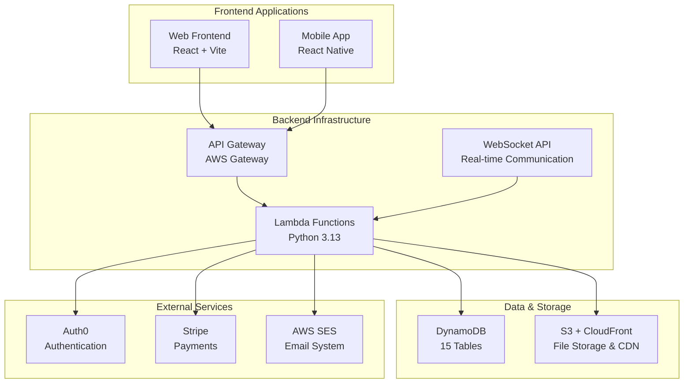
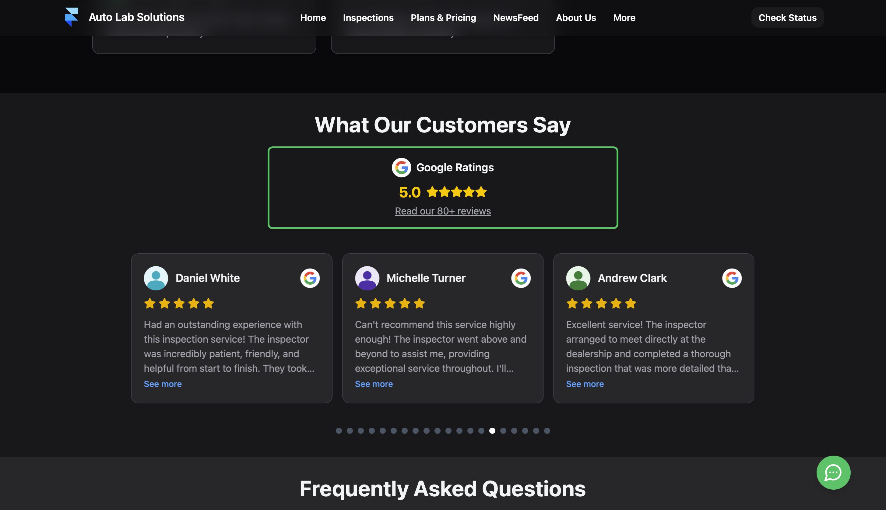

# 🚗 Auto Lab Solutions

*Professional automotive inspection and mobile repair services powered by cutting-edge technology*

[🌐 **Visit Website**](https://autolabsolutions.com) • [📱 **Book Inspection**](https://autolabsolutions.com/booking) • [💬 **Live Chat**](https://autolabsolutions.com) • [📞 **Contact Us**](https://autolabsolutions.com/contact)

---

## 🏢 About Auto Lab Solutions

Auto Lab Solutions is Perth's automotive inspection and mobile repair service, delivering professional and reliable automotive services through modern digital technology.

### 🎯 Our Mission
To provide comprehensive automotive inspections and services through innovative technology, ensuring customers make informed decisions about their vehicles.

### ⭐ Why Choose Us
- **🔍 Comprehensive Inspections** - Detailed vehicle assessments
- **📱 Mobile Services** - We come to you
- **🤖 Technology-Driven** - Digital reporting and diagnostics
- **🎯 Transparent Process** - Clear, detailed reports
- **⚡ Fast Turnaround** - Same-day reports

  

---

## 🛠️ Our Technology Stack

Auto Lab Solutions is built on a comprehensive, modern technology stack designed for scalability, security, and exceptional user experience.

### 🏗️ **System Architecture**

### 💻 **Frontend Technologies**
- **⚛️ React 18.3.1** - Modern UI development with hooks and context
- **⚡ Vite 5.4.1** - Lightning-fast build tool and development server
- **🌊 Tailwind CSS** - Utility-first styling framework
- **🎭 Framer Motion** - Smooth animations and transitions
- **📱 React Native** - Cross-platform mobile development

### ☁️ **Backend Infrastructure**
- **🐍 Python 3.13** - 40+ serverless Lambda functions
- **🌐 AWS API Gateway** - RESTful API with custom domain
- **🔌 WebSocket API** - Real-time bidirectional communication
- **🗄️ DynamoDB** - 15 NoSQL tables with auto-scaling
- **📧 AWS SES** - Transactional email system

### 🔐 **Security & Authentication**
- **🔑 Auth0** - Enterprise-grade authentication
- **🛡️ JWT Tokens** - Secure API access control
- **🔒 SSL/TLS** - End-to-end encryption
- **👥 RBAC** - Role-based access control

---

## 🌟 Platform Features

### 🌐 **Web Platform**
*Professional automotive services accessible from any device*

**Key Features:**
- 🎬 **Dynamic Homepage** with parallax video backgrounds
- 📅 **Smart Booking System** with AI-powered scheduling
- 💳 **Secure Payments** via Stripe integration
- 💬 **Real-time Chat** for customer support
- 📊 **Status Tracking** for appointment management
- 📱 **Mobile Optimized** responsive design

  
  

### 📱 **Mobile Staff App**
*Comprehensive management tool for Auto Lab Solutions team*

**Role-Based Features:**
- 👑 **Admin Dashboard** - Complete system oversight and analytics
- 🎧 **Customer Support** - Live chat and appointment management
- 🔧 **Mechanic Tools** - Daily schedules and work reports
- 📋 **Clerk Functions** - Administrative support and documentation

  
  

### 🔄 **Serverless Backend**
*Scalable AWS infrastructure powering the entire ecosystem*

**Core Capabilities:**
- ⚡ **40+ Lambda Functions** for business logic
- 📬 **SQS Queues** for asynchronous processing
- 📧 **Email Automation** with template system
- 💰 **Payment Processing** with Stripe webhooks
- 📊 **Analytics Engine** for business intelligence

---

## 🔄 Service Workflow

### 📅 **Booking Process**

1. **🎯 Service Selection** - Choose from inspection packages
2. **📋 Information Gathering** - Vehicle and contact details
3. **⏰ Time Slot Selection** - AI-optimized scheduling
4. **✅ Booking Confirmation** - Instant confirmation and emails

  
  

### 💳 **Payment System**

**Secure Processing:**
- 💰 **Multiple Payment Methods** - Credit cards, digital wallets
- 🔒 **Stripe Integration** - PCI-compliant processing
- 📄 **Automated Invoicing** - PDF generation and delivery
- 📧 **Email Receipts** - Instant payment confirmations

  
  

### 📊 **Business Analytics**

**Comprehensive Insights:**
- 💰 **Revenue Tracking** - Financial performance analysis
- 👥 **Customer Analytics** - Behavior and retention metrics
- 🔧 **Service Analytics** - Popular services and efficiency
- ⏰ **Operational Analytics** - Resource utilization

  
  

---

## 💬 Real-time Communication

### 🌐 **Live Chat System**

**Features:**
- 💬 **Instant Messaging** - Real-time customer support
- 🔔 **Push Notifications** - Desktop and mobile alerts
- 👀 **Read Receipts** - Message delivery confirmation
- ⌨️ **Typing Indicators** - Live conversation feedback

  
  

### 📧 **Email Automation**

**Automated Communications:**
- ✅ **Appointment Confirmations** - Booking confirmations
- 🔄 **Status Updates** - Progress notifications
- 💳 **Payment Receipts** - Transaction confirmations
- 📊 **Report Deliveries** - Inspection result emails

  
  

---

## 👥 Team Management

### 🎯 **Role-Based Access**

**User Roles:**
- 👑 **Admin** - Full system access and management
- 🎧 **Customer Support** - Customer communication and scheduling
- 🔧 **Mechanic** - Field operations and reporting
- 📋 **Clerk** - Administrative support functions

  

### 📅 **Schedule Management**

**Scheduling Features:**
- 📅 **Daily Schedules** - Personalized mechanic calendars
- ⏰ **Time Slot Analysis** - Optimization tools for admins
- 🚫 **Unavailable Periods** - Maintenance and holiday blocking
- 🤖 **AI Recommendations** - Intelligent scheduling suggestions

  
  

---

## 📋 Service Management

### 🔍 **Appointment Tracking**

**Comprehensive Management:**
- 📋 **Appointment Dashboard** - Complete service overview
- 📊 **Status Tracking** - Real-time progress monitoring
- 📄 **Report Management** - Inspection documentation
- 💰 **Payment Integration** - Financial transaction tracking

  
  

### 📊 **Report System**

**Professional Documentation:**
- 📸 **Photo Evidence** - Detailed visual documentation
- 📄 **PDF Reports** - Professional formatted deliverables
- ✅ **Approval Workflow** - Quality assurance process
- 📧 **Automated Delivery** - Direct customer communication

  
  

---

## 📊 Business Intelligence

### 📈 **Analytics Dashboard**

**Key Metrics:**
- 💰 **Revenue Analytics** - Financial performance tracking
- 👥 **Customer Insights** - Behavior and retention analysis
- 🔧 **Service Performance** - Efficiency and quality metrics
- 📅 **Operational Data** - Resource utilization statistics

  

### 🧾 **Invoice Management**

**Financial Operations:**
- 📄 **Invoice Generation** - Professional billing system
- 🎯 **Service Selection** - Flexible pricing options
- 💳 **Payment Tracking** - Transaction monitoring
- 📧 **Automated Delivery** - Customer communication

  
  

---

## 🚀 Technology Highlights

### ⚡ **Performance**
- **🌐 Global CDN** - Fast content delivery worldwide
- **📱 Mobile-First Design** - Optimized for all devices
- **🔄 Real-time Updates** - Instant data synchronization
- **⚡ Serverless Architecture** - Auto-scaling infrastructure

### 🔐 **Security**
- **🛡️ Enterprise Authentication** - Auth0 integration
- **🔒 End-to-End Encryption** - Secure data transmission
- **👥 Role-Based Access** - Granular permission control
- **💳 PCI Compliance** - Secure payment processing

### 🌍 **Scalability**
- **☁️ AWS Infrastructure** - Enterprise-grade cloud hosting
- **📈 Auto-Scaling** - Dynamic resource allocation
- **🔄 Microservices** - Modular, maintainable architecture
- **📊 Analytics-Driven** - Data-informed optimization

---

## 📦 Our Repositories

### 🌐 **[Web Frontend](https://github.com/Auto-Lab-Solutions/Web-Frontend)**
*React-based customer-facing web application*
- ⚛️ React 18.3.1 with Vite build system
- 🎨 Tailwind CSS for responsive design
- 💳 Stripe payment integration
- 💬 Real-time WebSocket chat system

### 📱 **[Staff Mobile App](https://github.com/Auto-Lab-Solutions/Staff-Mobile-App)**
*React Native app for staff management*
- 📱 Cross-platform iOS/Android support
- 🔐 Role-based feature access
- 📊 Business analytics dashboard
- 🗓️ Appointment management tools

### ☁️ **[Backend System](https://github.com/Auto-Lab-Solutions/Web-Backend)**
*Serverless AWS infrastructure*
- 🐍 Python 3.13 Lambda functions
- 🗄️ DynamoDB database system
- 📧 Automated email system
- 🔄 Real-time WebSocket support

---

## 🏆 Key Features

- ⭐ **5-Star Google Rating** - Excellent customer reviews
- 🚀 **99.9% Uptime** - Reliable service
- ⚡ **Fast Performance** - Quick web response times
- 🔍 **Comprehensive Inspections** - Detailed vehicle assessments
- 📱 **Mobile Convenience** - We come to you
- 📊 **Transparent Reporting** - Photo-documented results

---

## 🤝 Connect With Us

### 🌐 **Online Presence**
- **🌍 Website**: [autolabsolutions.com](https://autolabsolutions.com)
- **📧 Email**: info@autolabsolutions.com
- **📞 Phone**: Available on website
- **💬 Live Chat**: Real-time support available

### 📍 **Service Areas**
- 🏙️ **Perth Metropolitan Area** - Complete coverage
- 🚗 **Mobile Service** - We come to you
- 🏢 **Commercial Inspections** - Fleet and business vehicles
- 🏠 **Residential Service** - Home and private inspections

### 📱 **Get Started**
1. **🌐 Visit Our Website** - Browse services and pricing
2. **📅 Book Online** - Easy 4-step booking process
3. **💬 Chat Support** - Get instant answers to questions
4. **📞 Call Direct** - Speak with our expert team

---

## 📄 License

This organization's repositories are available under various open-source licenses. Please check individual repository licenses for specific terms.

---

**🚗 Auto Lab Solutions - Where Technology Meets Automotive Excellence**

*Proudly serving Perth, Western Australia with professional automotive inspections and mobile repair services*

