# Auto Lab Solutions - Full-Stack Application Suite

<div align="center">

[](https://aws.amazon.com)
[](https://reactjs.org)
[](https://reactnative.dev)
[](https://python.org)
[](https://www.typescriptlang.org/)

*Serverless automotive service management platform built with modern cloud-native architecture*

</div>


## 🏗️ Architecture Overview

Auto Lab Solutions is a full-stack automotive service management platform implementing a microservices architecture on AWS infrastructure. The system consists of three main applications: a React web frontend, React Native mobile app, and Python serverless backend.

### 🎯 Technical Specifications
- **Architecture Pattern**: Event-driven microservices with serverless functions
- **Database**: NoSQL (DynamoDB) with 15 normalized tables
- **Authentication**: OAuth2/OpenID Connect via Auth0 with JWT tokens
- **Real-time Communication**: WebSocket API with connection management
- **Payment Processing**: Stripe API integration with webhook handling
- **File Storage**: S3 with CloudFront CDN distribution
- **Email System**: AWS SES with template engine and bounce handling

<div align="center">
  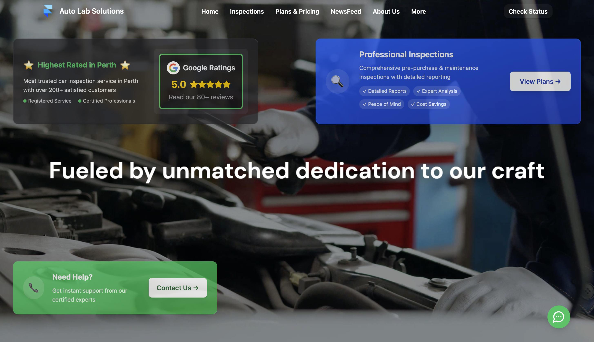
</div>

---

## ⚙️ System Architecture

The platform implements a distributed microservices architecture using AWS serverless technologies for scalability and cost optimization.

### 🏗️ **Infrastructure Diagram**

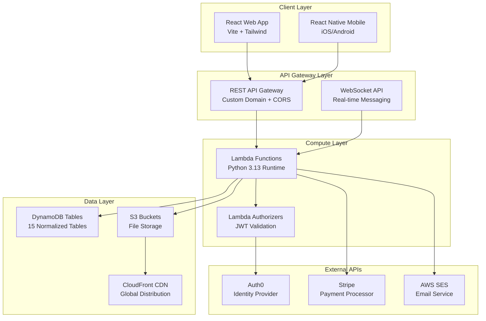
```mermaid
graph TB
    subgraph "Client Layer"
        A[React Web App<br/>Vite + Tailwind]
        B[React Native Mobile<br/>iOS/Android]
    end
    
    subgraph "API Gateway Layer"
        C[REST API Gateway<br/>Custom Domain + CORS]
        D[WebSocket API<br/>Real-time Messaging]
    end
    
    subgraph "Compute Layer"
        E[Lambda Functions<br/>Python 3.13 Runtime]
        F[Lambda Authorizers<br/>JWT Validation]
    end
    
    subgraph "Data Layer"
        G[DynamoDB Tables<br/>15 Normalized Tables]
        H[S3 Buckets<br/>File Storage]
        I[CloudFront CDN<br/>Global Distribution]
    end
    
    subgraph "External APIs"
        J[Auth0<br/>Identity Provider]
        K[Stripe<br/>Payment Processor]
        L[AWS SES<br/>Email Service]
    end
    
    A --> C
    B --> C
    C --> E
    D --> E
    E --> F
    E --> G
    E --> H
    H --> I
    F --> J
    E --> K
    E --> L
```

### 💻 **Frontend Stack**

#### Web Application
- **Framework**: React 18.3.1 with functional components and hooks
- **Build Tool**: Vite 5.4.1 for fast development and optimized builds
- **Styling**: Tailwind CSS 4.1.8 with custom design system
- **State Management**: React Context API with custom providers
- **Routing**: React Router 7.6.0 with lazy loading
- **Animations**: Framer Motion 11.18.2 for smooth transitions
- **HTTP Client**: Axios with interceptors and retry logic
- **Real-time**: Native WebSocket with automatic reconnection

#### Mobile Application
- **Framework**: React Native 0.80.0 with TypeScript
- **Navigation**: React Navigation 7.x with stack and tab navigators
- **State Management**: Context API with async storage persistence
- **Charts**: React Native Chart Kit for analytics visualization
- **File Handling**: React Native Document Picker for report uploads
- **Icons**: React Native Vector Icons with custom font sets
- **WebSocket**: Reconnecting WebSocket library for stability

### ☁️ **Backend Infrastructure**

#### Serverless Functions
- **Runtime**: Python 3.13
- **Function Count**: 40+ Lambda functions organized by domain
- **Memory Allocation**: 128MB to 1GB based on function requirements
- **Timeout Configuration**: 3-900 seconds depending on operation type

#### Database Design
- **Primary Database**: Amazon DynamoDB with on-demand billing
- **Table Count**: 15 tables with optimized partition key design
- **Indexing**: Global Secondary Indexes (GSI) for query patterns
- **Backup**: Point-in-time recovery enabled
- **Encryption**: Server-side encryption with AWS managed keys

#### API Architecture
- **API Gateway**: REST API with custom domain and SSL certificate
- **Rate Limiting**: Throttling at multiple rates based on whether customer or staff
- **CORS**: Configured for cross-origin requests from frontend domains
- **Authorization**: Lambda authorizers with Auth0 JWT validation
- **Monitoring**: CloudWatch logs enabled with structured logging

### 🔐 **Security Implementation**

#### Authentication Flow
- **Identity Provider**: Auth0 with custom post-login actions
- **Token Management**: JWT with RS256 signing algorithm
- **Token Validation**: Lambda authorizers with JWKS endpoint verification
- **Role-Based Access Control**: Custom claims in JWT tokens

#### Data Security
- **Encryption in Transit**: TLS 1.3 for all API communications
- **Encryption at Rest**: AES-256 encryption for DynamoDB and S3
- **Input Validation**: Comprehensive server-side validation with custom decorators


---

## 🛠️ Core System Components

### 🌐 **Web Frontend Application**
*Customer-facing React application with responsive design*

#### Technical Implementation
- **Component Library**: Custom reusable components with Shadcn UI
- **Styling**: Tailwind CSS for responsive design
- **State Management**: Custom hooks with Context API for global state
- **Error Handling**: React Error Boundaries for graceful error handling

<div align="center">
  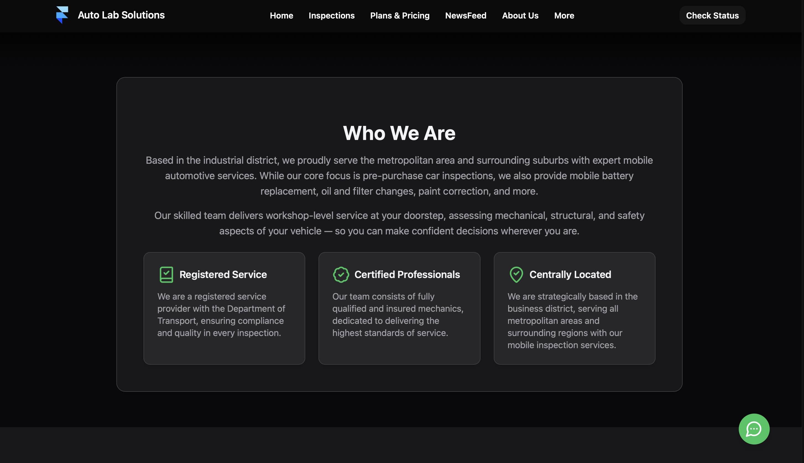
</div>

<div align="center">
  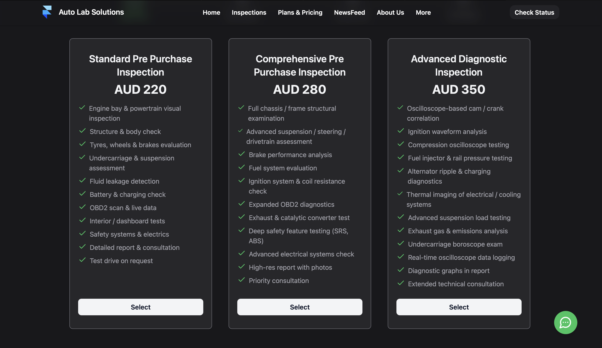
  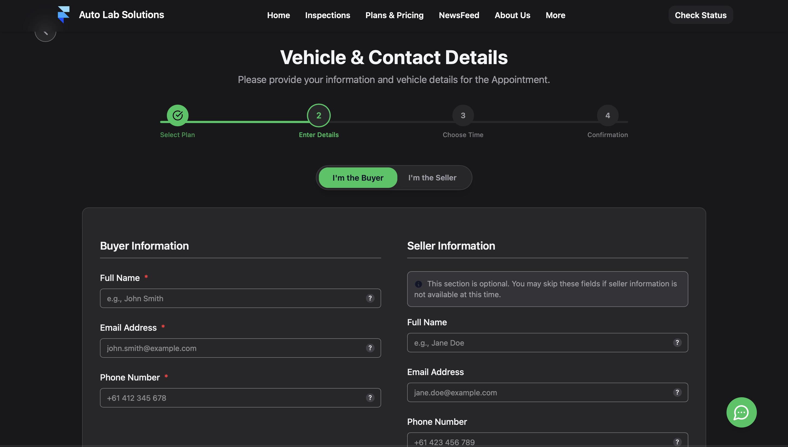
</div>

#### Key Features
- **Real-time Updates**: WebSocket connection with automatic reconnection
- **Payment Integration**: Stripe Elements for secure payment processing
- **Form Validation**: Custom validations with real-time feedback
- **Service Selection**: Interactive service plan selection interface
- **Booking System**: Multi-step booking process with validation

### 📱 **Mobile Staff Application**
*Cross-platform React Native app for operations management*

#### Technical Specifications
- **Platform Support**: iOS 15.1+ and Android API 21+
- **State Persistence**: AsyncStorage for local data storage

<div align="center">
  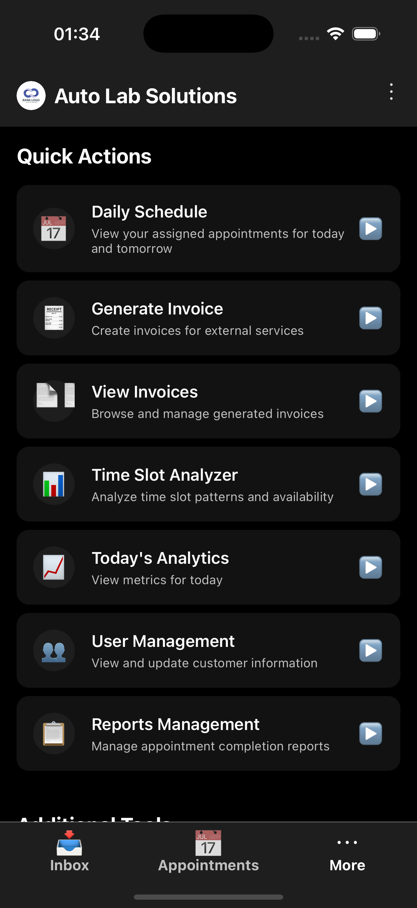
  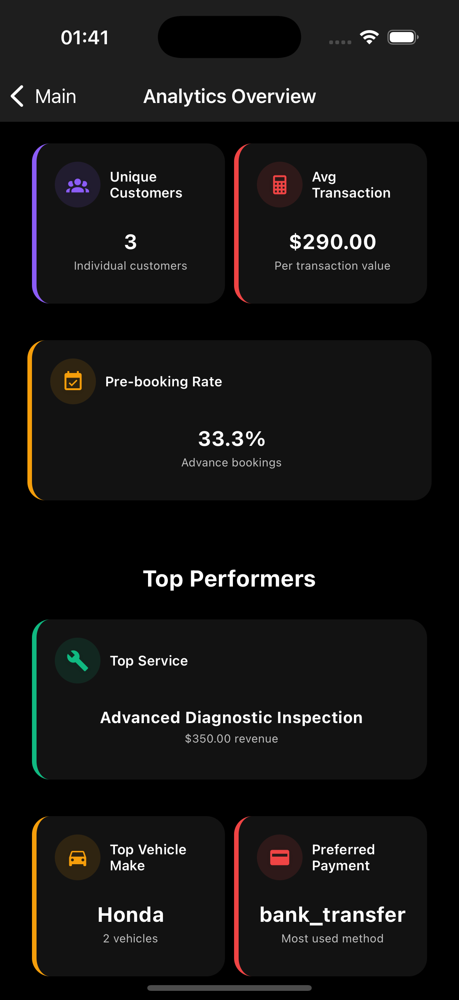
</div>

<div align="center">
  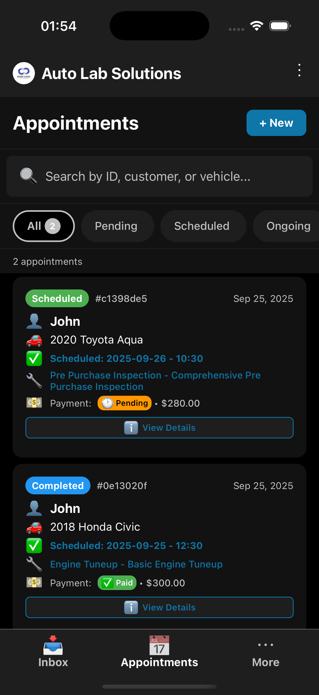
  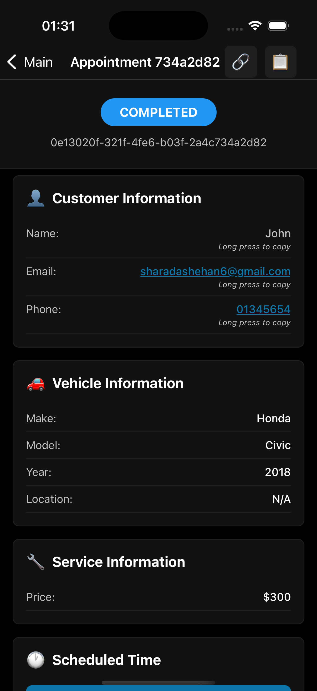
</div>

#### Role-Based Feature Access

The mobile application implements granular permission control based on staff roles:

#### 👑 **Admin Users**
- Full system access and administrative controls
- Business analytics and reporting
- Staff role management
- Invoice generation and management
- Time slot analysis tools

#### 🎧 **Customer Support**
- Customer communication management
- Appointment scheduling and management
- Customer user information updates
- Email thread management
- Invoice viewing capabilities

#### 🔧 **Mechanic**
- Daily schedule viewing
- Appointment status updates
- Report uploads for completed work

#### 📋 **Clerk**
- Appointment management support
- Report uploads for completed work

#### Permission Matrix

| Feature | Admin | Customer Support | Mechanic | Clerk |
|---------|-------|------------------|----------|-------|
| Analytics Overview | ✅ | ❌ | ❌ | ❌ |
| Customer Analytics | ✅ | ✅ | ❌ | ❌ |
| Appointment Management | ✅ | ✅ | ✅ | ✅ |
| Customer Messages | ❌ | ✅ | ❌ | ❌ |
| Invoice Generation | ✅ | ❌ | ❌ | ❌ |
| Invoice Viewing | ✅ | ✅ | ❌ | ❌ |
| Staff Role Management | ✅ | ❌ | ❌ | ❌ |
| Report Uploads | ❌ | ❌ | ✅ | ✅ |
| Report Approval | ✅ | ❌ | ❌ | ❌ |
| Time Slot Management | ✅ | ✅ | ❌ | ❌ |
| Daily Schedule | ✅ | ✅ | ✅ | ❌ |
| User Management | ✅ | ✅ | ❌ | ❌ |

The system allows to assign multiple roles to a single user for flexible access control.

#### Core Features
- **Real-time Messaging**: WebSocket implementation with message queuing
- **File Upload**: Multi-part upload to S3 with progress tracking
- **Analytics Dashboard**: React Native Chart Kit for data visualization

### ⚡ **Serverless Backend System**
*AWS Lambda-based microservices architecture*

#### Lambda Function Organization
```
lambda/
├── api/                    # REST API endpoints
│   ├── appointments/       # CRUD operations
│   ├── orders/             # Order management
│   ├── payments/          # Stripe integration
│   ├── users/             # User management
│   └── analytics/         # Business intelligence
│   └── ...
├── websocket/             # Real-time communication
│   ├── connect/           # Connection management
│   ├── disconnect/        # Cleanup handlers
│   └── init/              # customer connection initialization
│   └── staff-init/       # Staff-specific initialization
├── async/                 # Background processing
│   ├── email-queue/       # SQS email processor
│   ├── invoice-generator/ # PDF generation
│   └── notification/      # General notifications
└── auth/                  # Authentication
    └── authorizer/        # JWT validation
```


## 🔄 Data Flow & API Architecture

### � **Database Schema Design**

#### DynamoDB Table Structure

The system uses a NoSQL approach with Amazon DynamoDB, featuring 15 optimized tables designed for scalability and performance. Key tables include Staff management with email-based partition keys, Users with unique identifiers, Appointments with comprehensive indexing for status and time-based queries, and Payments linked to Stripe integration. Each table implements Global Secondary Indexes (GSI) for efficient query patterns and follows DynamoDB best practices for partition key distribution.

<div align="center">
  
  
</div>

### 💳 **Payment Processing Architecture**

#### Stripe Integration Implementation
The payment system integrates with Stripe using Payment Intents for secure transaction processing. When a payment is initiated, the system creates a payment intent with AUD currency and comprehensive metadata including appointment details and customer information. Payment records are immediately stored in DynamoDB with pending status, linking to the Stripe payment intent ID.

<div align="center">
  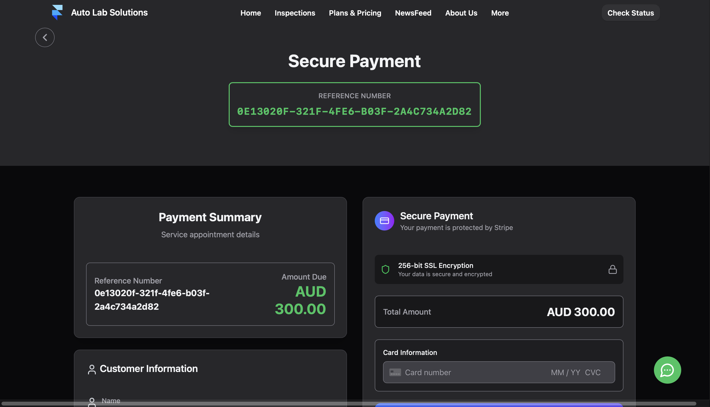
  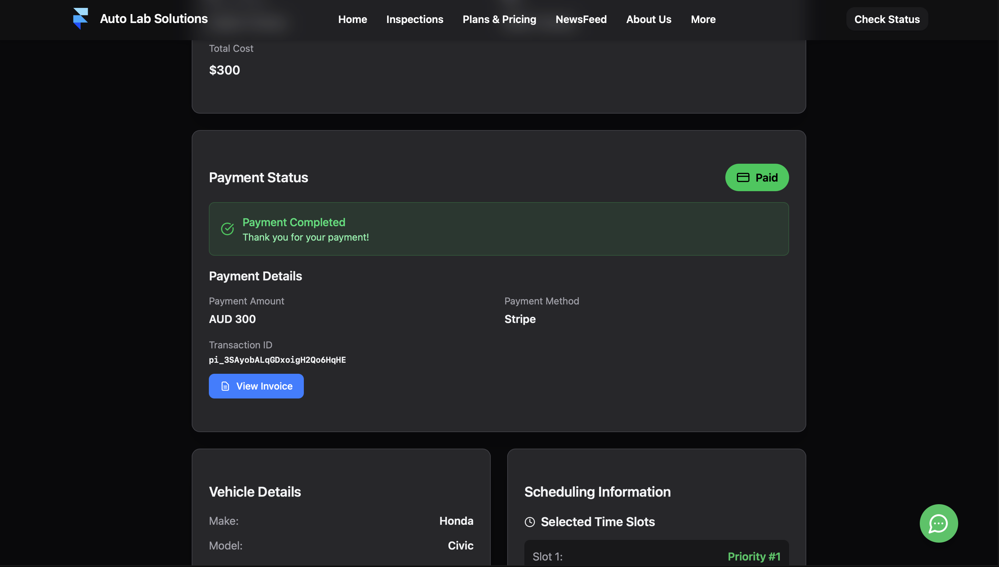
</div>

#### Webhook Processing
The system implements secure webhook processing for Stripe payment events with signature verification to ensure authentic requests. Webhooks handle various payment states including successful payments, failed transactions, and disputed charges. Each webhook event triggers appropriate business logic such as updating appointment statuses, sending confirmation emails, and recording transaction metrics. The system maintains idempotency to handle duplicate webhook deliveries and implements comprehensive error handling with retry mechanisms.

### 📊 **Analytics & Data Processing**

#### Business Intelligence Queries
The analytics system implements comprehensive revenue and business intelligence queries using DynamoDB's flexible querying and scanning capabilities. The system aggregates payment data by service type and payment method, providing detailed revenue breakdowns across custom date ranges. Analytics queries include total revenue calculations, transaction pattern analysis, and growth rate metrics. The service utilizes DynamoDB's scan operations with filter expressions for efficient data retrieval and implements advanced aggregation algorithms for real-time business insights.

<div align="center">
  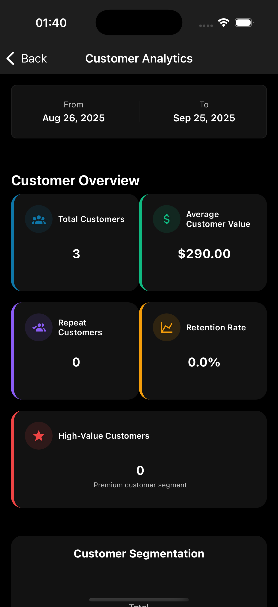
  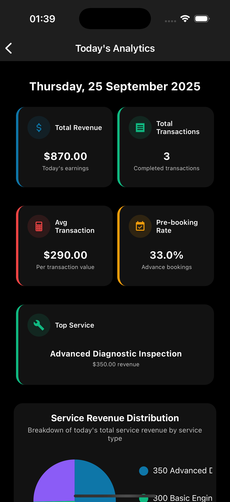
</div>

---

## � Real-time Communication System

### 🌐 **WebSocket Implementation**

#### Connection Management
The WebSocket system implements robust connection management using AWS API Gateway WebSocket API with Lambda backend functions. Connections are tracked in DynamoDB with timestamps and status information, enabling efficient cleanup of stale connections. The system handles connection establishment, message routing, and graceful disconnection with automatic cleanup processes. Connection state is managed per user session with support for multiple concurrent connections per user.

<div align="center">
  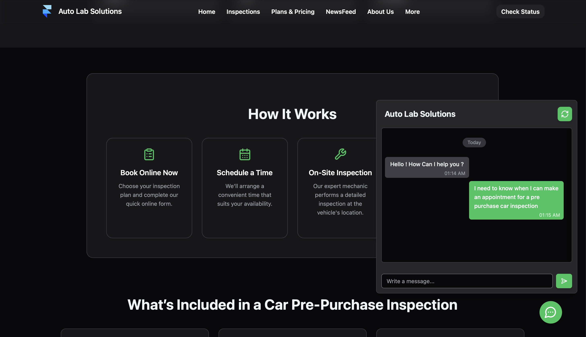
  
</div>

#### Message Broadcasting
The message broadcasting system enables real-time communication by delivering messages to all relevant staff connections. The system maintains active connection pools and implements broadcasting message delivery with automatic error handling and stale connection cleanup. Message routing is based on user roles and context, ensuring appropriate staff members receive relevant notifications.

### 📧 **Email System Architecture**

#### AWS SES Integration
The email system utilizes AWS SES with custom email templates for dynamic email generation. Templates support both HTML and plain text formats with comprehensive variable substitution and conditional content rendering. The system includes email suppression list management to handle bounces and complaints automatically. Email delivery includes comprehensive logging, analytics tracking, and attachment support with S3 integration for difficult files.

<div align="center">
  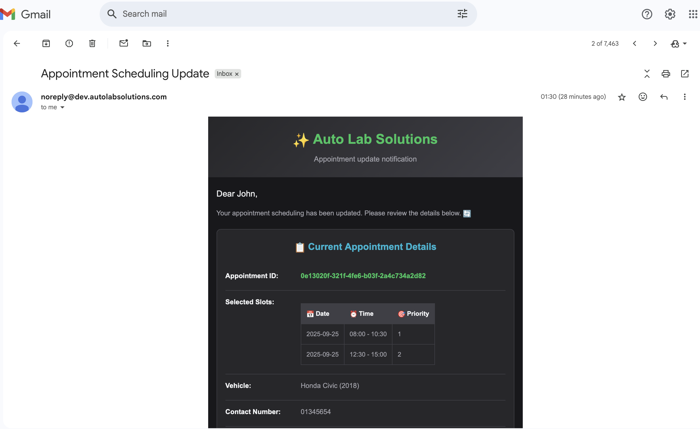
  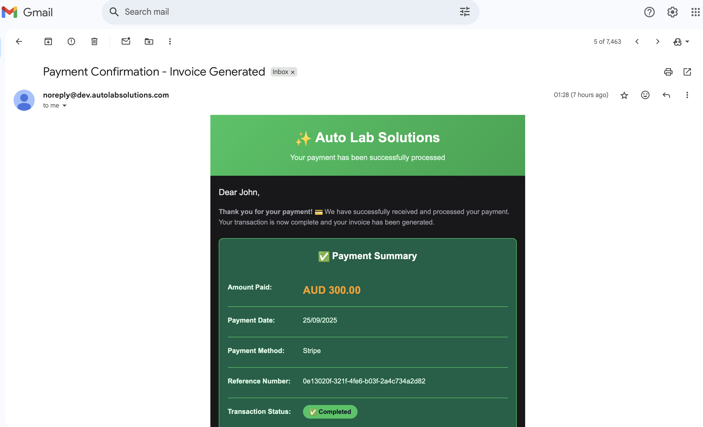
</div>

#### SES Bounce Handling
The system automatically processes SES notifications for email bounces and complaints through SNS webhook integration. Hard bounces result in automatic addition to the email suppression list to prevent future delivery attempts. The system categorizes bounce types and implements appropriate handling strategies, including retry logic for soft bounces and permanent suppression for invalid addresses.

---

## 👥 User Management & RBAC System

### 🎯 **Role-Based Access Control Implementation**

#### Permission Matrix
The system implements comprehensive Role-Based Access Control (RBAC) using enumerated permissions and role-based permission sets. Permissions are categorized by functionality including analytics access, user management capabilities, appointment operations, messaging privileges, and report handling. Each role (Admin, Customer Support, Mechanic, Clerk) has a specific set of permissions that determine feature access. The permission system supports granular control over individual operations and can be extended to support custom permission combinations for specialized roles.

<div align="center">
  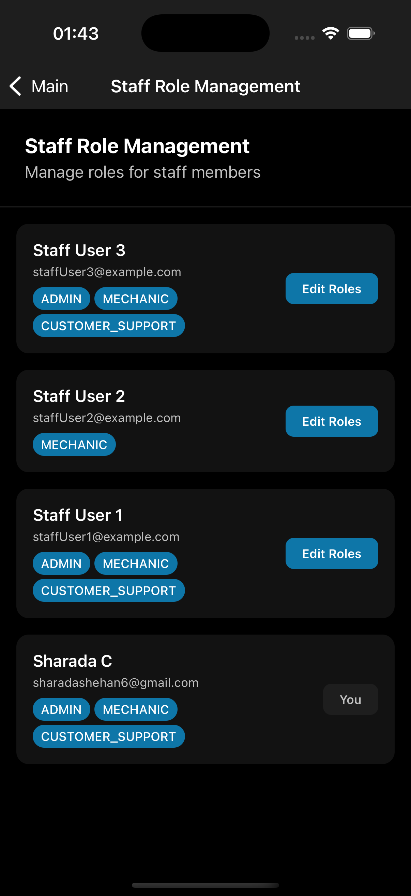
</div>

#### Permission Validation Decorator
The system implements function-level permission checking through Python decorators that validate user permissions before executing protected operations. The decorator extracts user context from request headers, retrieves assigned roles from JWT claims, and checks required permissions against the user's role-based permission set. Missing permissions result in appropriate HTTP error responses with detailed permission requirement information.

### 📅 **Intelligent Scheduling System**

#### Time Slot Generation Algorithm
The intelligent scheduling system generates available time slots using Perth timezone (AWST/AWDT) with configurable business hours and service duration requirements. The algorithm implements conflict detection against existing appointments, manually blocked periods, and minimum booking notice requirements. Each generated slot includes availability status, recommendation scores based on optimal booking times, and detailed conflict information when slots are unavailable.

<div align="center">
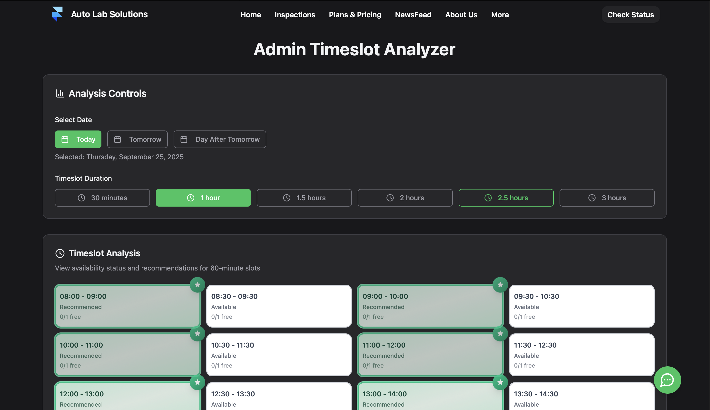
  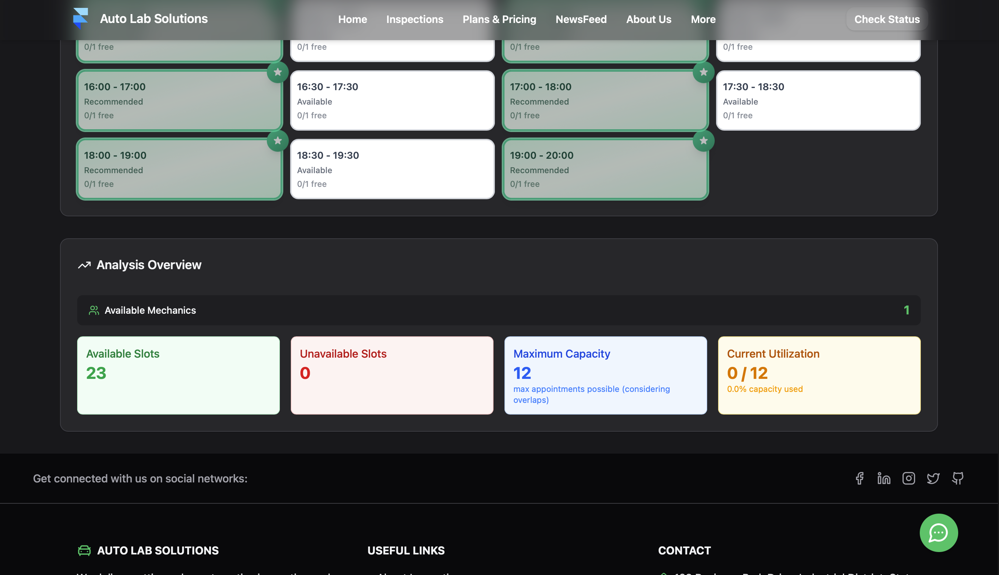
</div>

#### Conflict Detection & Resolution
The conflict detection system performs real-time availability checking by querying existing appointments, manually blocked time periods, and minimum booking notice requirements. The system checks for time range overlaps using sophisticated algorithms and provides detailed conflict reasons when slots are unavailable. Business rule validations include Perth timezone handling, mechanics availability count, and holiday management integration.

---

## � File Management & Report Processing

### 🔍 **Document Processing Pipeline**

#### S3 Upload with Presigned URLs
The file upload system implements secure presigned URL generation for direct client-to-S3 uploads with comprehensive validation and security controls. The system validates file types, sizes, and content types before generating time-limited upload URLs. Files are organized in S3 with appointment-specific folder structures and unique filename generation to prevent conflicts.

<div align="center">
  
  
</div>

#### Reports Upload & Approval Workflow

Our report processing system automates the entire workflow from upload to customer delivery. When mechanics upload inspection reports, the system automatically creates database records, tracks file metadata, and triggers admin notifications. The approval workflow includes status tracking, admin review capabilities, and automated customer notifications upon approval. This ensures quality control while maintaining transparency throughout the service process.

<div align="center">
  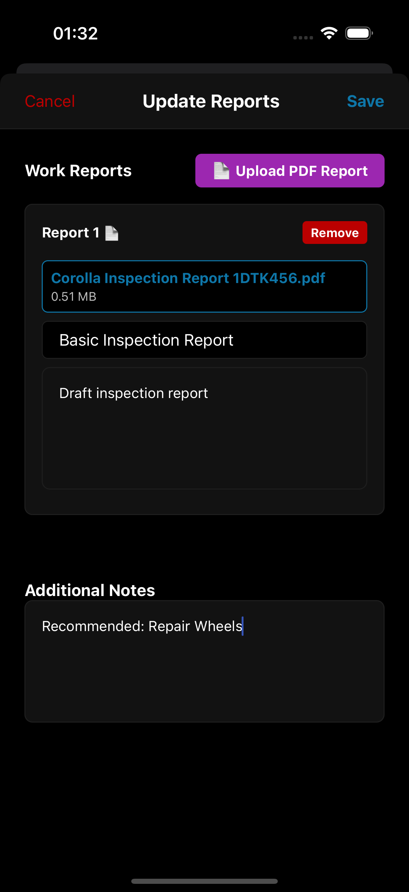
  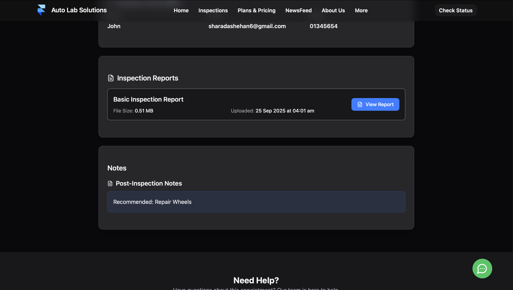
</div>

### 📊 **PDF Generation & Delivery System**

#### Automated Invoice Generation

Our PDF generation system creates professional invoices automatically upon payment completion. The system generates customized invoice content with appointment details, service information, and payment data. Generated PDFs are stored in S3 with optimized caching through CloudFront, ensuring fast global delivery. Each invoice includes unique identifiers, payment confirmations, and service details for complete financial transparency.

Upon manual payment approvals (by admin), the system creates necessary payment records, generates PDF invoices, sends confirmation emails, and records revenue metrics. The service ensures accurate financial tracking with automated payment status updates and comprehensive audit trails for all transactions.

<div align="center">
  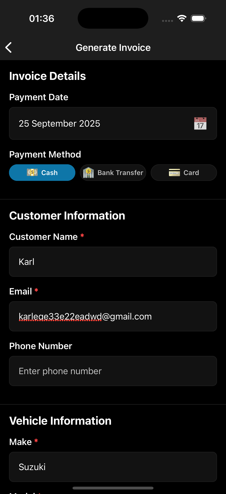
  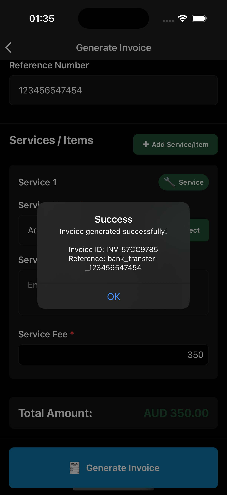
</div>

---

## 🚀 Deployment & DevOps

### ⚡ **CI/CD Pipeline Implementation**

#### GitHub Actions Workflow

Our CI/CD pipeline automates deployment with comprehensive validation, testing, and environment-specific deployments. The workflow validates CloudFormation templates, performs Python syntax checks and manages environment-specific deployments. Workflow deploys committed changes to the relevant environment automatically, accessing relevant AWS credentials securely through GitHub Environment Secrets. The deployment process includes Lambda function packaging and uploading, updating CloudFormation stacks, re-deploying API Gateway configurations, configure necessary Route53 DNS records as needed, and invalidating CloudFront caches to ensure smooth and reliable deployments.

#### Infrastructure as Code

Our infrastructure uses CloudFormation templates for consistent, version-controlled deployment across environments. The main stack defines API Gateway with custom domains, Lambda execution roles with precise DynamoDB permissions, and environment-specific parameter management. This Infrastructure as Code approach ensures reproducible deployments, proper security configurations, and seamless environment management from development to production, maintaining different settings for each environment.

---

## 📚 Repository Architecture

### 🌐 **[Web Frontend](https://github.com/Auto-Lab-Solutions/Web-Frontend)**
*React 18.3.1 + Vite customer-facing application*

#### Technical Stack

Built with React 18.3.1 and Vite 5.4.1 for optimal performance and development experience. The frontend uses Tailwind CSS for styling, Context API with custom hooks for state management, and React Router for navigation. Enhanced with Framer Motion animations, Axios HTTP client with interceptors, native WebSocket API for real-time features, and Stripe Elements for secure payment processing.

#### Development Setup

Quick setup process with npm installation, environment configuration for API endpoints and Stripe keys, and development server running on localhost:5173. Production builds are optimized through Vite with preview capabilities for testing production builds locally.

### 📱 **[Staff Mobile App](https://github.com/Auto-Lab-Solutions/Staff-Mobile-App)**
*React Native 0.80.0 cross-platform staff management application*

#### Technical Stack

Built with React Native 0.80.0 and TypeScript 5.0.4 for cross-platform mobile development. Features React Navigation 7.x for seamless navigation, Context API with AsyncStorage for state persistence, React Native Chart Kit for analytics visualization, and React Native Document Picker for file handling. Includes React Native Vector Icons for consistent iconography, reconnecting WebSocket for reliable real-time communication, and supports iOS 15.1+ and Android API 21+.

#### Development Setup

Standardized setup with npm installation, iOS pod installation for dependencies, and environment configuration for Auth0, API endpoints, and WebSocket URLs. Supports running on both iOS simulator and Android emulator with hot reloading for efficient development.

### ☁️ **[Backend System](https://github.com/Auto-Lab-Solutions/Web-Backend)**
*Python 3.13 serverless AWS infrastructure*

#### Technical Stack

Serverless architecture powered by Python 3.13 runtime with AWS Lambda and API Gateway. Features DynamoDB with 15 optimized tables, Auth0 JWT authentication, comprehensive Stripe API integration with webhooks, AWS SES email templates, S3 file storage with CloudFront CDN, WebSocket API for real-time communication, SQS queues for async processing, CloudWatch monitoring, CloudFormation Infrastructure as Code, and 40+ specialized Lambda functions.

#### Development Setup

Comprehensive setup with Python virtual environment, pip dependency installation, AWS CLI configuration for ap-southeast-2 or us-east-1 regions, environment-specific configuration for secrets like Stripe keys and Auth0 domain and automated infrastructure deployment scripts.

---

<br/>
<div align="center">

**Auto Lab Solutions - Modern Automotive Service Platform**

*Built with serverless architecture, modern frameworks, and developer-first principles*

[](https://github.com/Auto-Lab-Solutions/Web-Backend)
[](https://github.com/Auto-Lab-Solutions/Web-Frontend)
[](https://github.com/Auto-Lab-Solutions/Staff-Mobile-App)

</div>
