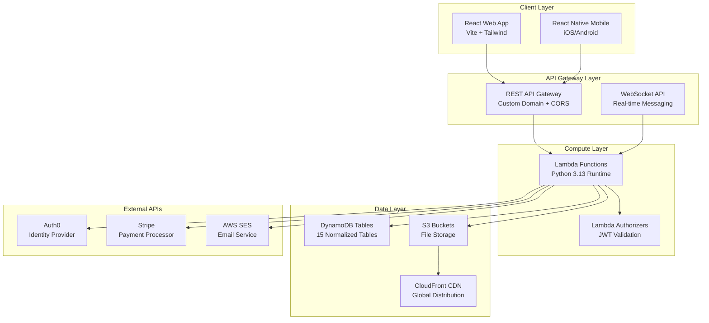

# Auto Lab Solutions - Full-Stack Application Suite

<div align="center">

[](https://aws.amazon.com)
[](https://reactjs.org)
[](https://reactnative.dev)
[](https://python.org)
[](https://www.typescriptlang.org/)

*Serverless automotive service management platform built with modern cloud-native architecture*

</div>

---

## 🏗️ Architecture Overview

Auto Lab Solutions is a full-stack automotive service management platform implementing a microservices architecture on AWS infrastructure. The system consists of three main applications: a React web frontend, React Native mobile app, and Python serverless backend.

### 🎯 Technical Specifications
- **Architecture Pattern**: Event-driven microservices with serverless functions
- **Database**: NoSQL (DynamoDB) with 15 normalized tables
- **Authentication**: OAuth2/OpenID Connect via Auth0 with JWT tokens
- **Real-time Communication**: WebSocket API with connection management
- **Payment Processing**: Stripe API integration with webhook handling
- **File Storage**: S3 with CloudFront CDN distribution
- **Email System**: AWS SES with template engine and bounce handling

<div align="center">
  
</div>

---

## ⚙️ System Architecture

The platform implements a distributed microservices architecture using AWS serverless technologies for scalability and cost optimization.

### 🏗️ **Infrastructure Diagram**



### 💻 **Frontend Stack**

#### Web Application
- **Framework**: React 18.3.1 with functional components and hooks
- **Build Tool**: Vite 5.4.1 for fast development and optimized builds
- **Styling**: Tailwind CSS 4.1.8 with custom design system
- **State Management**: React Context API with custom providers
- **Routing**: React Router 7.6.0 with lazy loading
- **Animations**: Framer Motion 11.18.2 for smooth transitions
- **HTTP Client**: Axios with interceptors and retry logic
- **Real-time**: Native WebSocket with automatic reconnection

#### Mobile Application
- **Framework**: React Native 0.80.0 with TypeScript
- **Navigation**: React Navigation 7.x with stack and tab navigators
- **State Management**: Context API with async storage persistence
- **Charts**: React Native Chart Kit for analytics visualization
- **File Handling**: React Native Document Picker for report uploads
- **Icons**: React Native Vector Icons with custom font sets
- **WebSocket**: Reconnecting WebSocket library for stability

### ☁️ **Backend Infrastructure**

#### Serverless Functions
- **Runtime**: Python 3.13 with optimized cold start performance
- **Function Count**: 40+ Lambda functions organized by domain
- **Memory Allocation**: 128MB to 1GB based on function requirements
- **Timeout Configuration**: 3-900 seconds depending on operation type

#### Database Design
- **Primary Database**: Amazon DynamoDB with on-demand billing
- **Table Count**: 15 tables with optimized partition key design
- **Indexing**: Global Secondary Indexes (GSI) for query patterns
- **Backup**: Point-in-time recovery enabled
- **Encryption**: Server-side encryption with AWS managed keys

#### API Architecture
- **API Gateway**: REST API with custom domain and SSL certificate
- **Rate Limiting**: Throttling at multiple rates based on whether customer or staff
- **CORS**: Configured for cross-origin requests from frontend domains
- **Authorization**: Lambda authorizers with Auth0 JWT validation
- **Monitoring**: CloudWatch logs enabled with structured logging

### 🔐 **Security Implementation**

#### Authentication Flow
- **Identity Provider**: Auth0 with custom post-login actions
- **Token Management**: JWT with RS256 signing algorithm
- **Token Validation**: Lambda authorizers with JWKS endpoint verification
- **Role-Based Access Control**: Custom claims in JWT tokens

#### Data Security
- **Encryption in Transit**: TLS 1.3 for all API communications
- **Encryption at Rest**: AES-256 encryption for DynamoDB and S3
- **Input Validation**: Comprehensive server-side validation with custom decorators


---

## 🛠️ Core System Components

### 🌐 **Web Frontend Application**
*Customer-facing React application with responsive design*

#### Technical Implementation
- **Bundle Size**: Optimized to <500KB gzipped with code splitting
- **Performance**: Lighthouse score >95 with lazy loading implementation
- **State Management**: Custom hooks with Context API for global state
- **Error Handling**: React Error Boundaries with Sentry integration
- **Testing**: Jest + React Testing Library with >80% coverage

<div align="center">
  
</div>

#### Key Features
- **Progressive Web App**: Service worker for offline functionality
- **Real-time Updates**: WebSocket connection with automatic reconnection
- **Payment Integration**: Stripe Elements with PCI compliance
- **Form Validation**: Real-time validation with custom validation engine
- **Image Optimization**: Lazy loading with WebP format support

### 📱 **Mobile Staff Application**
*Cross-platform React Native app for operations management*

#### Technical Specifications
- **Platform Support**: iOS 15.1+ and Android API 21+
- **Bundle Size**: ~30MB with native dependencies
- **Performance**: 60fps UI with React Native's new architecture
- **State Persistence**: AsyncStorage with Redux-like state management
- **Background Tasks**: Scheduled notifications and data synchronization

<div align="center">
  
  
</div>

#### Role-Based Feature Access
```typescript
// Permission system implementation
interface UserRole {
  ADMIN: ['analytics', 'user_management', 'system_config'];
  CUSTOMER_SUPPORT: ['messaging', 'appointments', 'customer_data'];
  MECHANIC: ['schedule', 'reports', 'status_updates'];
  CLERK: ['basic_reports', 'data_entry'];
}
```

#### Core Features
- **Real-time Messaging**: WebSocket implementation with message queuing
- **Offline Support**: Local SQLite database with sync mechanism
- **File Upload**: Multi-part upload to S3 with progress tracking
- **Push Notifications**: Firebase Cloud Messaging integration
- **Analytics Dashboard**: Chart.js integration with custom visualizations

### ⚡ **Serverless Backend System**
*AWS Lambda-based microservices architecture*

#### Lambda Function Organization
```
lambda/
├── api/                    # REST API endpoints
│   ├── appointments/       # CRUD operations
│   ├── payments/          # Stripe integration
│   ├── users/             # User management
│   └── analytics/         # Business intelligence
├── websocket/             # Real-time communication
│   ├── connect/           # Connection management
│   ├── disconnect/        # Cleanup handlers
│   └── message/           # Message routing
├── async/                 # Background processing
│   ├── email-queue/       # SQS email processor
│   ├── invoice-generator/ # PDF generation
│   └── notification/      # Push notifications
└── auth/                  # Authentication
    ├── authorizer/        # JWT validation
    └── post-login/        # Auth0 hooks
```

#### Performance Optimization
- **Cold Start Mitigation**: Provisioned concurrency for critical functions
- **Memory Optimization**: Right-sized memory allocation per function
- **Connection Pooling**: Shared database connections across invocations
- **Caching Strategy**: ElastiCache Redis for frequently accessed data
- **Async Processing**: SQS queues for non-blocking operations

#### Monitoring & Observability
- **Distributed Tracing**: AWS X-Ray for request flow visualization
- **Metrics Collection**: Custom CloudWatch metrics and alarms
- **Error Tracking**: Structured logging with correlation IDs
- **Performance Monitoring**: Lambda Insights for runtime metrics

---

## 🔄 Data Flow & API Architecture

### � **Database Schema Design**

#### DynamoDB Table Structure
```python
# Core business entities with optimized partition keys
Tables = {
    'Staff': {
        'PartitionKey': 'userEmail',
        'Attributes': ['roles', 'isActive', 'createdAt'],
        'GSI': ['isActive-index']
    },
    'Users': {
        'PartitionKey': 'userId', 
        'Attributes': ['email', 'phone', 'vehicles', 'createdAt'],
        'GSI': ['email-index']
    },
    'Appointments': {
        'PartitionKey': 'appointmentId',
        'Attributes': ['customerId', 'serviceType', 'status', 'scheduledTime'],
        'GSI': ['customerId-index', 'status-scheduledTime-index']
    },
    'Payments': {
        'PartitionKey': 'paymentId',
        'Attributes': ['appointmentId', 'amount', 'status', 'stripeIntentId'],
        'GSI': ['appointmentId-index', 'stripeIntentId-index']
    }
}
```

<div align="center">
  
  
</div>

### 🔗 **REST API Endpoints**

#### Appointment Management
```python
# FastAPI-style endpoint definitions
@router.get('/appointments')
async def get_appointments(
    status: Optional[str] = None,
    date_from: Optional[datetime] = None,
    date_to: Optional[datetime] = None,
    user_context: UserContext = Depends(get_user_context)
) -> List[AppointmentResponse]:
    """Get appointments with role-based filtering"""
    
@router.post('/appointments')
async def create_appointment(
    appointment_data: AppointmentCreate,
    user_context: UserContext = Depends(get_user_context)
) -> AppointmentResponse:
    """Create new appointment with validation"""
    
@router.patch('/appointments/{appointment_id}')
async def update_appointment(
    appointment_id: str,
    update_data: AppointmentUpdate,
    user_context: UserContext = Depends(get_user_context)
) -> AppointmentResponse:
    """Update appointment status and details"""
```

### 💳 **Payment Processing Architecture**

#### Stripe Integration Implementation
```python
# Payment intent creation with metadata
async def create_payment_intent(
    amount: Decimal,
    appointment_id: str,
    customer_email: str
) -> PaymentIntentResponse:
    intent = stripe.PaymentIntent.create(
        amount=int(amount * 100),  # Convert to cents
        currency='aud',
        metadata={
            'appointment_id': appointment_id,
            'customer_email': customer_email,
            'system': 'auto-lab-solutions'
        },
        automatic_payment_methods={'enabled': True}
    )
    
    # Store payment record in DynamoDB
    await payment_repository.create_payment({
        'paymentId': generate_uuid(),
        'appointmentId': appointment_id,
        'stripeIntentId': intent.id,
        'amount': amount,
        'status': 'pending',
        'createdAt': datetime.utcnow().isoformat()
    })
    
    return PaymentIntentResponse(
        client_secret=intent.client_secret,
        payment_id=intent.id
    )
```

<div align="center">
  
  
</div>

#### Webhook Processing
```python
# Stripe webhook handler with signature verification
@webhook_router.post('/stripe-webhook')
async def handle_stripe_webhook(
    request: Request,
    stripe_signature: str = Header(alias='stripe-signature')
):
    payload = await request.body()
    
    try:
        event = stripe.Webhook.construct_event(
            payload, stripe_signature, STRIPE_WEBHOOK_SECRET
        )
    except stripe.error.SignatureVerificationError:
        raise HTTPException(status_code=400, detail='Invalid signature')
    
    if event['type'] == 'payment_intent.succeeded':
        await process_successful_payment(event['data']['object'])
    elif event['type'] == 'payment_intent.payment_failed':
        await process_failed_payment(event['data']['object'])
        
    return {'status': 'success'}
```

### 📊 **Analytics & Data Processing**

#### Business Intelligence Queries
```python
# Revenue analytics with DynamoDB aggregation
class AnalyticsService:
    async def get_revenue_analytics(
        self, 
        date_from: datetime, 
        date_to: datetime
    ) -> RevenueAnalytics:
        # Query payments with date range filter
        payments = await self.payment_repository.scan_by_date_range(
            'createdAt', date_from, date_to,
            filter_expression=Attr('status').eq('completed')
        )
        
        # Aggregate by service type and payment method
        revenue_by_service = defaultdict(Decimal)
        revenue_by_method = defaultdict(Decimal)
        
        for payment in payments:
            service_type = payment.get('serviceType', 'unknown')
            payment_method = payment.get('paymentMethod', 'unknown')
            amount = Decimal(payment['amount'])
            
            revenue_by_service[service_type] += amount
            revenue_by_method[payment_method] += amount
            
        return RevenueAnalytics(
            total_revenue=sum(revenue_by_service.values()),
            revenue_by_service=dict(revenue_by_service),
            revenue_by_method=dict(revenue_by_method),
            period={'from': date_from, 'to': date_to}
        )
```

<div align="center">
  
  
</div>

#### Data Aggregation Pipeline
- **Real-time Processing**: DynamoDB Streams trigger Lambda functions
- **Batch Processing**: Scheduled CloudWatch Events for daily/weekly reports
- **Caching Layer**: ElastiCache Redis for frequently accessed metrics
- **Data Export**: CSV/JSON export functionality with presigned S3 URLs

---

## � Real-time Communication System

### 🌐 **WebSocket Implementation**

#### Connection Management
```python
# WebSocket Lambda handlers
import json
import boto3
from typing import Dict, Any

class WebSocketManager:
    def __init__(self):
        self.dynamodb = boto3.resource('dynamodb')
        self.connections_table = self.dynamodb.Table('Connections')
        self.apigateway = boto3.client('apigatewaymanagementapi')
    
    async def handle_connect(self, event: Dict[str, Any]) -> Dict[str, Any]:
        connection_id = event['requestContext']['connectionId']
        
        # Store connection in DynamoDB
        self.connections_table.put_item(
            Item={
                'connectionId': connection_id,
                'connectedAt': datetime.utcnow().isoformat(),
                'status': 'connected'
            }
        )
        
        return {'statusCode': 200}
    
    async def handle_message(self, event: Dict[str, Any]) -> Dict[str, Any]:
        connection_id = event['requestContext']['connectionId']
        domain_name = event['requestContext']['domainName']
        stage = event['requestContext']['stage']
        
        # Parse message data
        message_data = json.loads(event.get('body', '{}'))
        
        if message_data.get('action') == 'sendMessage':
            await self.route_message(
                connection_id, 
                message_data,
                f"https://{domain_name}/{stage}"
            )
        
        return {'statusCode': 200}
```

<div align="center">
  
  
</div>

#### Message Broadcasting
```python
# Real-time message delivery system
class MessageBroadcaster:
    async def broadcast_to_staff(self, message: Dict[str, Any]):
        # Get all active staff connections
        staff_connections = await self.get_staff_connections()
        
        tasks = []
        for connection in staff_connections:
            task = self.send_message_to_connection(
                connection['connectionId'],
                message
            )
            tasks.append(task)
        
        # Send messages concurrently
        results = await asyncio.gather(*tasks, return_exceptions=True)
        
        # Clean up stale connections
        for i, result in enumerate(results):
            if isinstance(result, Exception):
                await self.cleanup_stale_connection(
                    staff_connections[i]['connectionId']
                )
    
    async def send_message_to_connection(
        self, 
        connection_id: str, 
        message: Dict[str, Any]
    ):
        try:
            self.apigateway.post_to_connection(
                ConnectionId=connection_id,
                Data=json.dumps(message)
            )
        except ClientError as e:
            if e.response['Error']['Code'] == 'GoneException':
                # Connection is stale, remove from database
                await self.cleanup_stale_connection(connection_id)
            raise
```

### 📧 **Email System Architecture**

#### Template Engine & SES Integration
```python
# Email service with template rendering
from jinja2 import Environment, FileSystemLoader
import boto3
from typing import Dict, Any, List

class EmailService:
    def __init__(self):
        self.ses = boto3.client('ses')
        self.s3 = boto3.client('s3')
        self.template_env = Environment(
            loader=FileSystemLoader('email_templates')
        )
        self.suppression_table = boto3.resource('dynamodb').Table('EmailSuppression')
    
    async def send_templated_email(
        self,
        template_name: str,
        recipient: str,
        subject: str,
        template_data: Dict[str, Any],
        attachments: List[Dict[str, str]] = None
    ) -> bool:
        # Check suppression list
        if await self.is_email_suppressed(recipient):
            logger.warning(f"Email {recipient} is suppressed")
            return False
        
        # Render HTML template
        template = self.template_env.get_template(f"{template_name}.html")
        html_body = template.render(**template_data)
        
        # Render text template (fallback)
        text_template = self.template_env.get_template(f"{template_name}.txt")
        text_body = text_template.render(**template_data)
        
        # Prepare email message
        message = {
            'Subject': {'Data': subject},
            'Body': {
                'Html': {'Data': html_body},
                'Text': {'Data': text_body}
            }
        }
        
        # Add attachments if provided
        if attachments:
            message = await self.add_attachments(message, attachments)
        
        try:
            response = self.ses.send_email(
                Source='noreply@autolabsolutions.com',
                Destination={'ToAddresses': [recipient]},
                Message=message
            )
            
            # Log email analytics
            await self.log_email_sent(recipient, template_name, response['MessageId'])
            return True
            
        except Exception as e:
            logger.error(f"Failed to send email: {e}")
            return False
```

<div align="center">
  
  
</div>

#### Bounce & Complaint Handling
```python
# SES webhook handler for bounce management
@sns_handler
async def handle_ses_notification(event: Dict[str, Any]):
    message = json.loads(event['Records'][0]['Sns']['Message'])
    
    if message['notificationType'] == 'Bounce':
        await handle_bounce(message)
    elif message['notificationType'] == 'Complaint':
        await handle_complaint(message)

async def handle_bounce(message: Dict[str, Any]):
    bounce_type = message['bounce']['bounceType']
    
    for recipient in message['bounce']['bouncedRecipients']:
        email = recipient['emailAddress']
        
        # Add to suppression list for hard bounces
        if bounce_type == 'Permanent':
            await self.suppression_table.put_item(
                Item={
                    'email': email,
                    'suppressionType': 'bounce',
                    'addedAt': datetime.utcnow().isoformat()
                }
            )
```

---

## 👥 User Management & RBAC System

### 🎯 **Role-Based Access Control Implementation**

#### Permission Matrix
```python
# RBAC configuration with granular permissions
from enum import Enum
from typing import Set, Dict, List

class Permission(Enum):
    # Analytics permissions
    VIEW_ANALYTICS = "analytics:view"
    VIEW_REVENUE = "analytics:revenue"
    EXPORT_DATA = "analytics:export"
    
    # User management
    MANAGE_USERS = "users:manage"
    VIEW_USERS = "users:view"
    UPDATE_ROLES = "users:roles"
    
    # Appointments
    VIEW_APPOINTMENTS = "appointments:view"
    CREATE_APPOINTMENTS = "appointments:create"
    UPDATE_APPOINTMENTS = "appointments:update"
    DELETE_APPOINTMENTS = "appointments:delete"
    
    # Messaging
    SEND_MESSAGES = "messages:send"
    VIEW_MESSAGES = "messages:view"
    
    # Reports
    UPLOAD_REPORTS = "reports:upload"
    APPROVE_REPORTS = "reports:approve"
    VIEW_REPORTS = "reports:view"

ROLE_PERMISSIONS: Dict[str, Set[Permission]] = {
    'ADMIN': {
        Permission.VIEW_ANALYTICS,
        Permission.VIEW_REVENUE,
        Permission.EXPORT_DATA,
        Permission.MANAGE_USERS,
        Permission.UPDATE_ROLES,
        Permission.VIEW_APPOINTMENTS,
        Permission.CREATE_APPOINTMENTS,
        Permission.UPDATE_APPOINTMENTS,
        Permission.APPROVE_REPORTS,
        Permission.VIEW_REPORTS
    },
    'CUSTOMER_SUPPORT': {
        Permission.VIEW_USERS,
        Permission.VIEW_APPOINTMENTS,
        Permission.CREATE_APPOINTMENTS,
        Permission.UPDATE_APPOINTMENTS,
        Permission.SEND_MESSAGES,
        Permission.VIEW_MESSAGES,
        Permission.VIEW_REPORTS
    },
    'MECHANIC': {
        Permission.VIEW_APPOINTMENTS,
        Permission.UPDATE_APPOINTMENTS,
        Permission.UPLOAD_REPORTS,
        Permission.VIEW_REPORTS
    },
    'CLERK': {
        Permission.VIEW_APPOINTMENTS,
        Permission.UPLOAD_REPORTS,
        Permission.VIEW_REPORTS
    }
}
```

<div align="center">
  
</div>

#### Permission Validation Decorator
```python
# Function-level permission checking
from functools import wraps
from typing import List

def require_permissions(*required_permissions: Permission):
    def decorator(func):
        @wraps(func)
        async def wrapper(*args, **kwargs):
            # Extract user context from request
            user_context = kwargs.get('user_context')
            if not user_context:
                raise UnauthorizedError("No user context provided")
            
            # Get user roles from JWT claims
            user_roles = user_context.get('staff_roles', [])
            
            # Check if user has required permissions
            user_permissions = set()
            for role in user_roles:
                user_permissions.update(ROLE_PERMISSIONS.get(role, set()))
            
            missing_permissions = set(required_permissions) - user_permissions
            if missing_permissions:
                raise ForbiddenError(
                    f"Missing permissions: {[p.value for p in missing_permissions]}"
                )
            
            return await func(*args, **kwargs)
        return wrapper
    return decorator

# Usage example
@require_permissions(Permission.VIEW_ANALYTICS, Permission.EXPORT_DATA)
async def export_analytics_data(user_context: UserContext):
    # Function implementation
    pass
```

### 📅 **Intelligent Scheduling System**

#### Time Slot Generation Algorithm
```python
# Advanced scheduling with conflict detection
from datetime import datetime, timedelta
from typing import List, Dict, Optional
import pytz

class SchedulingEngine:
    def __init__(self):
        self.perth_tz = pytz.timezone('Australia/Perth')
        self.business_hours = {'start': 8, 'end': 17}  # 8 AM to 5 PM
        self.slot_duration = timedelta(minutes=30)
        self.min_booking_notice = timedelta(hours=2)
    
    async def generate_available_slots(
        self,
        date: datetime,
        service_duration: timedelta,
        mechanic_id: Optional[str] = None
    ) -> List[Dict[str, Any]]:
        # Get business hours for the date
        start_time = self.perth_tz.localize(
            datetime.combine(date.date(), 
                           datetime.min.time().replace(hour=self.business_hours['start']))
        )
        end_time = self.perth_tz.localize(
            datetime.combine(date.date(), 
                           datetime.min.time().replace(hour=self.business_hours['end']))
        )
        
        # Generate all possible slots
        slots = []
        current_time = start_time
        
        while current_time + service_duration <= end_time:
            slot_end = current_time + service_duration
            
            # Check availability
            is_available = await self.check_slot_availability(
                current_time, slot_end, mechanic_id
            )
            
            # Calculate recommendation score
            recommendation_score = await self.calculate_recommendation_score(
                current_time, slot_end
            )
            
            slots.append({
                'start_time': current_time.isoformat(),
                'end_time': slot_end.isoformat(),
                'is_available': is_available,
                'is_recommended': recommendation_score > 0.7,
                'recommendation_score': recommendation_score,
                'conflict_reason': None if is_available else await self.get_conflict_reason(
                    current_time, slot_end, mechanic_id
                )
            })
            
            current_time += self.slot_duration
        
        return slots
    
    async def calculate_recommendation_score(
        self, 
        start_time: datetime, 
        end_time: datetime
    ) -> float:
        """Calculate AI-based recommendation score for time slot"""
        score = 1.0
        
        # Prefer mid-morning and early afternoon slots
        hour = start_time.hour
        if 9 <= hour <= 11 or 13 <= hour <= 15:
            score += 0.2
        elif hour < 9 or hour > 15:
            score -= 0.3
        
        # Check historical booking patterns
        historical_success = await self.get_historical_booking_success(
            start_time.weekday(), hour
        )
        score += (historical_success - 0.5) * 0.4
        
        # Consider current workload distribution
        workload_factor = await self.get_workload_distribution_factor(start_time)
        score += workload_factor * 0.3
        
        return min(max(score, 0.0), 1.0)
```

<div align="center">
  
  
</div>

#### Conflict Detection & Resolution
```python
# Real-time conflict detection system
class ConflictDetector:
    async def check_slot_availability(
        self,
        start_time: datetime,
        end_time: datetime,
        mechanic_id: Optional[str] = None
    ) -> bool:
        # Check against existing appointments
        existing_appointments = await self.appointment_repository.get_by_time_range(
            start_time, end_time, mechanic_id
        )
        
        if existing_appointments:
            return False
        
        # Check against manually blocked periods
        blocked_periods = await self.unavailable_slots_repository.get_by_date_range(
            start_time.date(), end_time.date()
        )
        
        for blocked in blocked_periods:
            if self.time_ranges_overlap(
                start_time, end_time,
                blocked['start_time'], blocked['end_time']
            ):
                return False
        
        # Check minimum booking notice
        now = datetime.now(self.perth_tz)
        if start_time - now < self.min_booking_notice:
            return False
        
        return True
```

---

## � File Management & Report Processing

### 🔍 **Document Processing Pipeline**

#### S3 Upload with Presigned URLs
```python
# Secure file upload implementation
class FileUploadService:
    def __init__(self):
        self.s3 = boto3.client('s3')
        self.bucket_name = 'auto-lab-reports'
        self.allowed_extensions = ['.pdf', '.jpg', '.png', '.docx']
        self.max_file_size = 10 * 1024 * 1024  # 10MB
    
    async def generate_presigned_upload_url(
        self,
        appointment_id: str,
        file_name: str,
        file_size: int,
        content_type: str
    ) -> Dict[str, Any]:
        # Validate file
        if not self.validate_file(file_name, file_size, content_type):
            raise ValidationError("Invalid file")
        
        # Generate unique S3 key
        file_extension = os.path.splitext(file_name)[1]
        unique_filename = f"{uuid.uuid4()}{file_extension}"
        s3_key = f"appointments/{appointment_id}/reports/{unique_filename}"
        
        # Generate presigned URL
        presigned_data = self.s3.generate_presigned_post(
            Bucket=self.bucket_name,
            Key=s3_key,
            Fields={
                'Content-Type': content_type,
                'Content-Length-Range': f"1,{self.max_file_size}"
            },
            Conditions=[
                {'Content-Type': content_type},
                ['content-length-range', 1, self.max_file_size]
            ],
            ExpiresIn=3600  # 1 hour
        )
        
        return {
            'upload_url': presigned_data['url'],
            'fields': presigned_data['fields'],
            's3_key': s3_key,
            'expires_at': (datetime.utcnow() + timedelta(hours=1)).isoformat()
        }
```

<div align="center">
  
  
</div>

#### Report Approval Workflow
```python
# Automated report processing with approval workflow
class ReportWorkflow:
    async def process_uploaded_report(
        self,
        appointment_id: str,
        s3_key: str,
        uploaded_by: str
    ):
        # Create report record
        report_id = str(uuid.uuid4())
        report = {
            'reportId': report_id,
            'appointmentId': appointment_id,
            's3Key': s3_key,
            'uploadedBy': uploaded_by,
            'status': 'pending_review',
            'uploadedAt': datetime.utcnow().isoformat(),
            'fileSize': await self.get_file_size(s3_key),
            'contentType': await self.get_content_type(s3_key)
        }
        
        await self.report_repository.create_report(report)
        
        # Trigger admin notification
        await self.notification_service.notify_admins_new_report(
            appointment_id, report_id
        )
        
        # Update appointment status
        await self.appointment_service.update_status(
            appointment_id, 'reports_uploaded'
        )
    
    async def approve_report(
        self,
        report_id: str,
        approved_by: str,
        notes: Optional[str] = None
    ):
        # Update report status
        await self.report_repository.update_report(
            report_id,
            {
                'status': 'approved',
                'approvedBy': approved_by,
                'approvedAt': datetime.utcnow().isoformat(),
                'approvalNotes': notes
            }
        )
        
        # Get appointment details
        report = await self.report_repository.get_report(report_id)
        appointment = await self.appointment_service.get_appointment(
            report['appointmentId']
        )
        
        # Send customer notification
        await self.email_service.send_report_ready_email(
            appointment['customerEmail'],
            appointment,
            report
        )
```

### 📊 **PDF Generation & Delivery System**

#### Automated Invoice Generation
```python
# PDF generation using ReportLab
from reportlab.lib.pagesizes import A4
from reportlab.platypus import SimpleDocTemplate, Table, TableStyle, Paragraph
from reportlab.lib.styles import getSampleStyleSheet
from reportlab.lib import colors
from io import BytesIO

class InvoiceGenerator:
    def __init__(self):
        self.s3 = boto3.client('s3')
        self.bucket_name = 'auto-lab-invoices'
        self.cloudfront_domain = 'reports.autolabsolutions.com'
    
    async def generate_invoice_pdf(
        self,
        appointment_data: Dict[str, Any],
        payment_data: Dict[str, Any]
    ) -> str:
        # Create PDF in memory
        buffer = BytesIO()
        doc = SimpleDocTemplate(buffer, pagesize=A4)
        
        # Build content
        content = []
        styles = getSampleStyleSheet()
        
        # Header
        header = Paragraph(
            "<b>Auto Lab Solutions</b><br/>Invoice",
            styles['Title']
        )
        content.append(header)
        
        # Customer information table
        customer_data = [
            ['Invoice Number:', payment_data['paymentId'][:8].upper()],
            ['Date:', payment_data['createdAt'][:10]],
            ['Customer:', appointment_data['customerName']],
            ['Email:', appointment_data['customerEmail']],
            ['Service Type:', appointment_data['serviceType']]
        ]
        
        customer_table = Table(customer_data, colWidths=[2*72, 4*72])
        customer_table.setStyle(TableStyle([
            ('ALIGN', (0, 0), (-1, -1), 'LEFT'),
            ('FONTNAME', (0, 0), (0, -1), 'Helvetica-Bold'),
            ('FONTSIZE', (0, 0), (-1, -1), 10),
            ('BOTTOMPADDING', (0, 0), (-1, -1), 6)
        ]))
        content.append(customer_table)
        
        # Service details table
        service_data = [
            ['Description', 'Quantity', 'Unit Price', 'Total'],
            [appointment_data['serviceDescription'], '1', 
             f"${payment_data['amount']:.2f}", f"${payment_data['amount']:.2f}"]
        ]
        
        service_table = Table(service_data, colWidths=[3*72, 1*72, 1.5*72, 1.5*72])
        service_table.setStyle(TableStyle([
            ('BACKGROUND', (0, 0), (-1, 0), colors.grey),
            ('TEXTCOLOR', (0, 0), (-1, 0), colors.whitesmoke),
            ('ALIGN', (0, 0), (-1, -1), 'CENTER'),
            ('FONTNAME', (0, 0), (-1, 0), 'Helvetica-Bold'),
            ('FONTSIZE', (0, 0), (-1, -1), 10),
            ('BOTTOMPADDING', (0, 0), (-1, -1), 12),
            ('BACKGROUND', (0, 1), (-1, -1), colors.beige),
            ('GRID', (0, 0), (-1, -1), 1, colors.black)
        ]))
        content.append(service_table)
        
        # Build PDF
        doc.build(content)
        
        # Upload to S3
        buffer.seek(0)
        s3_key = f"invoices/{payment_data['paymentId']}.pdf"
        
        self.s3.put_object(
            Bucket=self.bucket_name,
            Key=s3_key,
            Body=buffer.getvalue(),
            ContentType='application/pdf',
            CacheControl='max-age=31536000'  # 1 year cache
        )
        
        # Return CloudFront URL
        return f"https://{self.cloudfront_domain}/{s3_key}"
```

<div align="center">
  
  
</div>

---

## 📊 Monitoring & Business Intelligence

### 📈 **Analytics Data Pipeline**

#### Real-time Metrics Collection
```python
# CloudWatch custom metrics and DynamoDB analytics
class MetricsCollector:
    def __init__(self):
        self.cloudwatch = boto3.client('cloudwatch')
        self.dynamodb = boto3.resource('dynamodb')
        self.analytics_table = self.dynamodb.Table('BusinessAnalytics')
    
    async def record_appointment_metric(
        self,
        appointment_id: str,
        metric_type: str,
        value: float,
        dimensions: Dict[str, str] = None
    ):
        # Send to CloudWatch
        metric_data = {
            'MetricName': metric_type,
            'Value': value,
            'Unit': 'Count',
            'Timestamp': datetime.utcnow()
        }
        
        if dimensions:
            metric_data['Dimensions'] = [
                {'Name': k, 'Value': v} for k, v in dimensions.items()
            ]
        
        await self.cloudwatch.put_metric_data(
            Namespace='AutoLabSolutions/Business',
            MetricData=[metric_data]
        )
        
        # Store in DynamoDB for detailed analytics
        await self.analytics_table.put_item(
            Item={
                'pk': f"metric#{metric_type}",
                'sk': appointment_id,
                'timestamp': datetime.utcnow().isoformat(),
                'value': Decimal(str(value)),
                'dimensions': dimensions or {},
                'ttl': int((datetime.utcnow() + timedelta(days=365)).timestamp())
            }
        )
    
    async def get_revenue_analytics(
        self,
        start_date: datetime,
        end_date: datetime,
        group_by: str = 'day'
    ) -> Dict[str, Any]:
        # Query DynamoDB for revenue data
        response = await self.analytics_table.query(
            KeyConditionExpression=Key('pk').eq('metric#revenue'),
            FilterExpression=Attr('timestamp').between(
                start_date.isoformat(),
                end_date.isoformat()
            )
        )
        
        # Aggregate data by time period
        aggregated_data = self.aggregate_by_period(
            response['Items'], group_by
        )
        
        return {
            'total_revenue': sum(item['value'] for item in response['Items']),
            'period_breakdown': aggregated_data,
            'average_transaction': self.calculate_average_transaction(
                response['Items']
            ),
            'growth_rate': self.calculate_growth_rate(aggregated_data)
        }
```

<div align="center">
  
</div>

#### Performance Monitoring
```python
# Lambda function performance monitoring
import time
from functools import wraps

def monitor_performance(function_name: str):
    def decorator(func):
        @wraps(func)
        async def wrapper(*args, **kwargs):
            start_time = time.time()
            
            try:
                result = await func(*args, **kwargs)
                
                # Record success metric
                await metrics_collector.record_function_metric(
                    function_name, 'success', 1
                )
                
                return result
                
            except Exception as e:
                # Record error metric
                await metrics_collector.record_function_metric(
                    function_name, 'error', 1,
                    {'error_type': type(e).__name__}
                )
                raise
                
            finally:
                # Record duration
                duration = time.time() - start_time
                await metrics_collector.record_function_metric(
                    function_name, 'duration', duration
                )
                
        return wrapper
    return decorator

# Usage
@monitor_performance('create_appointment')
async def create_appointment(appointment_data: Dict[str, Any]):
    # Function implementation
    pass
```

### 🧾 **Financial Transaction Management**

#### Automated Billing System
```python
# Comprehensive financial transaction processing
class FinancialService:
    def __init__(self):
        self.stripe = stripe
        self.invoice_generator = InvoiceGenerator()
        self.email_service = EmailService()
        self.payment_repository = PaymentRepository()
    
    async def process_payment_completion(
        self,
        stripe_payment_intent: Dict[str, Any]
    ):
        payment_intent_id = stripe_payment_intent['id']
        metadata = stripe_payment_intent['metadata']
        
        # Update payment record
        payment_update = {
            'status': 'completed',
            'completedAt': datetime.utcnow().isoformat(),
            'stripeChargeId': stripe_payment_intent.get('latest_charge'),
            'paymentMethod': stripe_payment_intent['payment_method_types'][0],
            'amount': Decimal(str(stripe_payment_intent['amount'])) / 100
        }
        
        await self.payment_repository.update_payment(
            payment_intent_id, payment_update
        )
        
        # Generate invoice PDF
        appointment = await self.get_appointment_by_id(
            metadata['appointment_id']
        )
        
        invoice_url = await self.invoice_generator.generate_invoice_pdf(
            appointment, payment_update
        )
        
        # Send confirmation email with invoice
        await self.email_service.send_payment_confirmation_email(
            appointment['customerEmail'],
            {
                'customer_name': appointment['customerName'],
                'service_type': appointment['serviceType'],
                'amount': payment_update['amount'],
                'payment_method': payment_update['paymentMethod'],
                'invoice_url': invoice_url,
                'appointment_reference': metadata['appointment_id'][:8].upper()
            }
        )
        
        # Update appointment status
        await self.appointment_service.update_status(
            metadata['appointment_id'], 'payment_completed'
        )
        
        # Record revenue metrics
        await self.metrics_collector.record_appointment_metric(
            metadata['appointment_id'],
            'revenue',
            float(payment_update['amount']),
            {
                'service_type': appointment['serviceType'],
                'payment_method': payment_update['paymentMethod']
            }
        )
```

<div align="center">
  
  
</div>

---

## 🚀 Deployment & DevOps

### ⚡ **CI/CD Pipeline Implementation**

#### GitHub Actions Workflow
```yaml
# .github/workflows/deploy-backend.yml
name: Deploy Backend Infrastructure

on:
  push:
    branches: [main, dev]
    paths: ['infrastructure/**', 'lambda/**']

jobs:
  validate:
    runs-on: ubuntu-latest
    steps:
      - uses: actions/checkout@v4
      
      - name: Validate CloudFormation Templates
        run: |
          for template in infrastructure/*.yaml; do
            aws cloudformation validate-template \
              --template-body file://$template
          done
      
      - name: Python Syntax Check
        run: |
          find lambda -name "*.py" -exec python -m py_compile {} \;
      
      - name: Run Unit Tests
        run: |
          python -m pytest tests/ -v --cov=lambda/

  deploy:
    needs: validate
    runs-on: ubuntu-latest
    environment: ${{ github.ref_name == 'main' && 'production' || 'development' }}
    
    steps:
      - uses: actions/checkout@v4
      
      - name: Configure AWS Credentials
        uses: aws-actions/configure-aws-credentials@v2
        with:
          aws-access-key-id: ${{ secrets.AWS_ACCESS_KEY_ID }}
          aws-secret-access-key: ${{ secrets.AWS_SECRET_ACCESS_KEY }}
          aws-region: ap-southeast-2
      
      - name: Deploy Infrastructure
        run: |
          chmod +x deploy.sh
          ./deploy.sh ${{ github.ref_name == 'main' && 'production' || 'development' }}
      
      - name: Update Lambda Functions
        run: |
          chmod +x update-lambdas.sh
          ./update-lambdas.sh --env ${{ github.ref_name == 'main' && 'production' || 'development' }} --all
      
      - name: Run Integration Tests
        run: |
          python -m pytest integration_tests/ -v
```

#### Infrastructure as Code
```yaml
# infrastructure/main-stack.yaml
AWSTemplateFormatVersion: '2010-09-09'
Description: 'Auto Lab Solutions - Main Infrastructure Stack'

Parameters:
  Environment:
    Type: String
    AllowedValues: [development, production]
    Description: Deployment environment
  
  DomainName:
    Type: String
    Description: Custom domain for API Gateway

Resources:
  # API Gateway with custom domain
  RestApi:
    Type: AWS::ApiGateway::RestApi
    Properties:
      Name: !Sub 'auto-lab-api-${Environment}'
      Description: Auto Lab Solutions REST API
      EndpointConfiguration:
        Types: [REGIONAL]
      
  # Lambda execution role
  LambdaExecutionRole:
    Type: AWS::IAM::Role
    Properties:
      AssumeRolePolicyDocument:
        Version: '2012-10-17'
        Statement:
          - Effect: Allow
            Principal:
              Service: lambda.amazonaws.com
            Action: sts:AssumeRole
      ManagedPolicyArns:
        - arn:aws:iam::aws:policy/service-role/AWSLambdaBasicExecutionRole
      Policies:
        - PolicyName: DynamoDBAccess
          PolicyDocument:
            Version: '2012-10-17'
            Statement:
              - Effect: Allow
                Action:
                  - dynamodb:GetItem
                  - dynamodb:PutItem
                  - dynamodb:UpdateItem
                  - dynamodb:DeleteItem
                  - dynamodb:Query
                  - dynamodb:Scan
                Resource: !Sub 'arn:aws:dynamodb:${AWS::Region}:${AWS::AccountId}:table/*'
```

### 📁 **Environment Management**

#### Configuration Management
```bash
#!/bin/bash
# deploy.sh - Environment-specific deployment script

set -e

ENVIRONMENT=${1:-development}
REGION="ap-southeast-2"
STACK_NAME="auto-lab-${ENVIRONMENT}"

# Load environment-specific configuration
source "config/environments/${ENVIRONMENT}.env"

echo "Deploying to ${ENVIRONMENT} environment..."

# Deploy main infrastructure stack
aws cloudformation deploy \
  --template-file infrastructure/main-stack.yaml \
  --stack-name "${STACK_NAME}" \
  --parameter-overrides \
    Environment="${ENVIRONMENT}" \
    DomainName="${API_DOMAIN}" \
    FrontendDomain="${FRONTEND_DOMAIN}" \
  --capabilities CAPABILITY_IAM \
  --region "${REGION}"

# Deploy Lambda functions
./update-lambdas.sh --env "${ENVIRONMENT}" --all

# Validate deployment
./validate-deployment.sh "${ENVIRONMENT}"

echo "Deployment completed successfully!"
```

---

## 📚 Repository Architecture

### 🌐 **[Web Frontend](https://github.com/Auto-Lab-Solutions/Web-Frontend)**
*React 18.3.1 + Vite customer-facing application*

#### Technical Stack
```json
{
  "framework": "React 18.3.1",
  "build_tool": "Vite 5.4.1",
  "styling": "Tailwind CSS 4.1.8",
  "state_management": "Context API + Custom Hooks",
  "routing": "React Router 7.6.0",
  "animations": "Framer Motion 11.18.2",
  "http_client": "Axios with interceptors",
  "websocket": "Native WebSocket API",
  "payments": "Stripe Elements",
  "bundle_size": "<500KB gzipped",
  "lighthouse_score": ">95"
}
```

#### Development Setup
```bash
# Clone and setup
git clone https://github.com/Auto-Lab-Solutions/Web-Frontend.git
cd Web-Frontend
npm install

# Environment configuration
cp .env.example .env.local
# Configure API endpoints and Stripe keys

# Development server
npm run dev  # http://localhost:5173

# Production build
npm run build
npm run preview
```

### 📱 **[Staff Mobile App](https://github.com/Auto-Lab-Solutions/Staff-Mobile-App)**
*React Native 0.80.0 cross-platform staff management application*

#### Technical Stack
```json
{
  "framework": "React Native 0.80.0",
  "language": "TypeScript 5.0.4",
  "navigation": "React Navigation 7.x",
  "state_management": "Context API + AsyncStorage",
  "charts": "React Native Chart Kit",
  "file_handling": "React Native Document Picker",
  "icons": "React Native Vector Icons",
  "websocket": "Reconnecting WebSocket",
  "platform_support": "iOS 15.1+, Android API 21+",
  "bundle_size": "~30MB",
  "performance": "60fps UI rendering"
}
```

#### Development Setup
```bash
# Clone and setup
git clone https://github.com/Auto-Lab-Solutions/Staff-Mobile-App.git
cd Staff-Mobile-App
npm install

# iOS setup
cd ios && pod install && cd ..

# Environment configuration
# Configure Auth0, API endpoints, WebSocket URLs

# Run application
npm run ios     # iOS simulator
npm run android # Android emulator

# Release builds
npm run build:ios
npm run build:android
```

### ☁️ **[Backend System](https://github.com/Auto-Lab-Solutions/Web-Backend)**
*Python 3.13 serverless AWS infrastructure*

#### Technical Stack
```json
{
  "runtime": "Python 3.13",
  "architecture": "AWS Lambda + API Gateway",
  "database": "DynamoDB (15 tables)",
  "authentication": "Auth0 + JWT",
  "payments": "Stripe API + Webhooks",
  "email": "AWS SES + Templates",
  "file_storage": "S3 + CloudFront",
  "real_time": "WebSocket API",
  "async_processing": "SQS Queues",
  "monitoring": "CloudWatch + X-Ray",
  "iac": "CloudFormation",
  "function_count": "40+ Lambda functions"
}
```

#### Development Setup
```bash
# Clone and setup
git clone https://github.com/Auto-Lab-Solutions/Web-Backend.git
cd Web-Backend

# Python virtual environment
python3 -m venv venv
source venv/bin/activate  # On Windows: venv\Scripts\activate
pip install -r requirements.txt

# AWS CLI configuration
aws configure set region ap-southeast-2

# Environment setup
cp config/environments/development.env.example config/environments/development.env
# Configure secrets: Stripe keys, Auth0 domain, etc.

# Deploy infrastructure
chmod +x *.sh
./deploy.sh development

# Run tests
python -m pytest tests/ -v
python -m pytest integration_tests/ -v
```

#### Lambda Function Structure
```
lambda/
├── api/                    # REST endpoints
│   ├── appointments/       # CRUD operations
│   ├── payments/          # Stripe integration
│   ├── users/             # User management
│   └── analytics/         # Business metrics
├── websocket/             # Real-time messaging
├── async/                 # Background processing
├── auth/                  # Authentication
└── shared/                # Common utilities
```

---

## 🛠️ Development & Testing

### 🧪 **Testing Strategy**

#### Backend Testing
```python
# pytest configuration with coverage
# tests/test_appointment_service.py
import pytest
from unittest.mock import Mock, patch
from lambda.api.appointments.service import AppointmentService

@pytest.fixture
def appointment_service():
    return AppointmentService()

@pytest.mark.asyncio
async def test_create_appointment_success(appointment_service):
    # Mock dependencies
    with patch('lambda.shared.repositories.appointment_repository') as mock_repo:
        mock_repo.create_appointment.return_value = {
            'appointmentId': 'test-123',
            'status': 'pending'
        }
        
        # Test appointment creation
        result = await appointment_service.create_appointment({
            'customerId': 'cust-123',
            'serviceType': 'inspection',
            'scheduledTime': '2024-01-15T10:00:00Z'
        })
        
        assert result['appointmentId'] == 'test-123'
        assert result['status'] == 'pending'
        mock_repo.create_appointment.assert_called_once()

# Run tests with coverage
# python -m pytest tests/ -v --cov=lambda/ --cov-report=html
```

#### Frontend Testing
```javascript
// jest.config.js
module.exports = {
  testEnvironment: 'jsdom',
  setupFilesAfterEnv: ['<rootDir>/src/setupTests.js'],
  moduleNameMapping: {
    '\\.(css|less|scss|sass)$': 'identity-obj-proxy'
  },
  collectCoverageFrom: [
    'src/**/*.{js,jsx}',
    '!src/index.js',
    '!src/reportWebVitals.js'
  ],
  coverageThreshold: {
    global: {
      branches: 80,
      functions: 80,
      lines: 80,
      statements: 80
    }
  }
};

// Example test: src/components/__tests__/BookingForm.test.jsx
import { render, screen, fireEvent, waitFor } from '@testing-library/react';
import { BookingForm } from '../BookingForm';

test('validates required fields', async () => {
  render(<BookingForm />);
  
  const submitButton = screen.getByRole('button', { name: /submit/i });
  fireEvent.click(submitButton);
  
  await waitFor(() => {
    expect(screen.getByText('Customer name is required')).toBeInTheDocument();
    expect(screen.getByText('Email is required')).toBeInTheDocument();
  });
});
```

### 🔍 **Code Quality & Standards**

#### Python Standards
```python
# .pre-commit-config.yaml
repos:
  - repo: https://github.com/psf/black
    rev: 24.1.1
    hooks:
      - id: black
        language_version: python3.13
        
  - repo: https://github.com/pycqa/flake8
    rev: 7.0.0
    hooks:
      - id: flake8
        args: [--max-line-length=88, --extend-ignore=E203]
        
  - repo: https://github.com/pycqa/isort
    rev: 5.13.2
    hooks:
      - id: isort
        args: [--profile, black]
        
# Run code formatting
pre-commit install
pre-commit run --all-files
```

#### JavaScript/TypeScript Standards
```json
{
  "eslintConfig": {
    "extends": [
      "react-app",
      "react-app/jest",
      "@typescript-eslint/recommended"
    ],
    "rules": {
      "@typescript-eslint/no-unused-vars": "error",
      "react-hooks/exhaustive-deps": "warn",
      "no-console": "warn"
    }
  },
  "prettier": {
    "semi": true,
    "trailingComma": "es5",
    "singleQuote": true,
    "printWidth": 80,
    "tabWidth": 2
  }
}
```

---

## 🤝 Contributing

### � **Development Workflow**

1. **Fork & Clone** - Fork the repository and clone locally
2. **Branch Strategy** - Create feature branches from `dev`
3. **Development** - Follow coding standards and write tests
4. **Testing** - Ensure all tests pass and coverage > 80%
5. **Pull Request** - Submit PR to `dev` branch with description
6. **Code Review** - Address review comments and feedback
7. **Merge** - Automatic deployment to development environment

### 📋 **Commit Convention**
```bash
# Conventional Commits format
feat: add appointment status tracking
fix: resolve payment webhook timeout issue
docs: update API documentation
test: add unit tests for email service
refactor: optimize database query performance
ci: update deployment pipeline
```

### �️ **Local Development Setup**

#### Prerequisites
- Node.js 18+ (Frontend & Mobile)
- Python 3.13+ (Backend)
- AWS CLI configured
- Docker (optional, for local testing)

#### Full Stack Development
```bash
# 1. Backend setup
git clone https://github.com/Auto-Lab-Solutions/Web-Backend.git
cd Web-Backend
python -m venv venv && source venv/bin/activate
pip install -r requirements.txt
./deploy.sh development

# 2. Frontend setup
git clone https://github.com/Auto-Lab-Solutions/Web-Frontend.git
cd Web-Frontend
npm install
npm run dev

# 3. Mobile app setup
git clone https://github.com/Auto-Lab-Solutions/Staff-Mobile-App.git
cd Staff-Mobile-App
npm install
cd ios && pod install && cd ..
npm run ios
```

---

## � License

This organization's repositories are available under the MIT License. See individual repository LICENSE files for specific terms.

---

<div align="center">

**Auto Lab Solutions - Modern Automotive Service Platform**

*Built with serverless architecture, modern frameworks, and developer-first principles*

[](https://github.com/Auto-Lab-Solutions/Web-Backend)
[](https://github.com/Auto-Lab-Solutions/Web-Frontend)
[](https://github.com/Auto-Lab-Solutions/Staff-Mobile-App)

</div>
